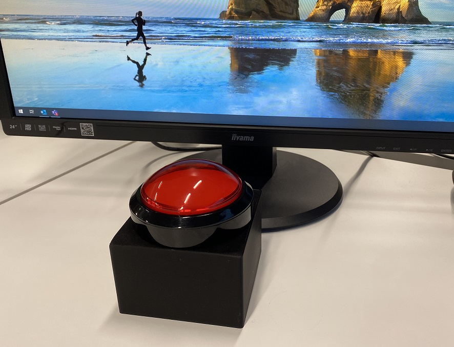
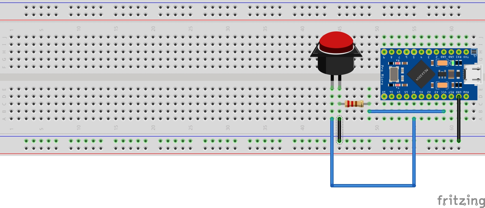
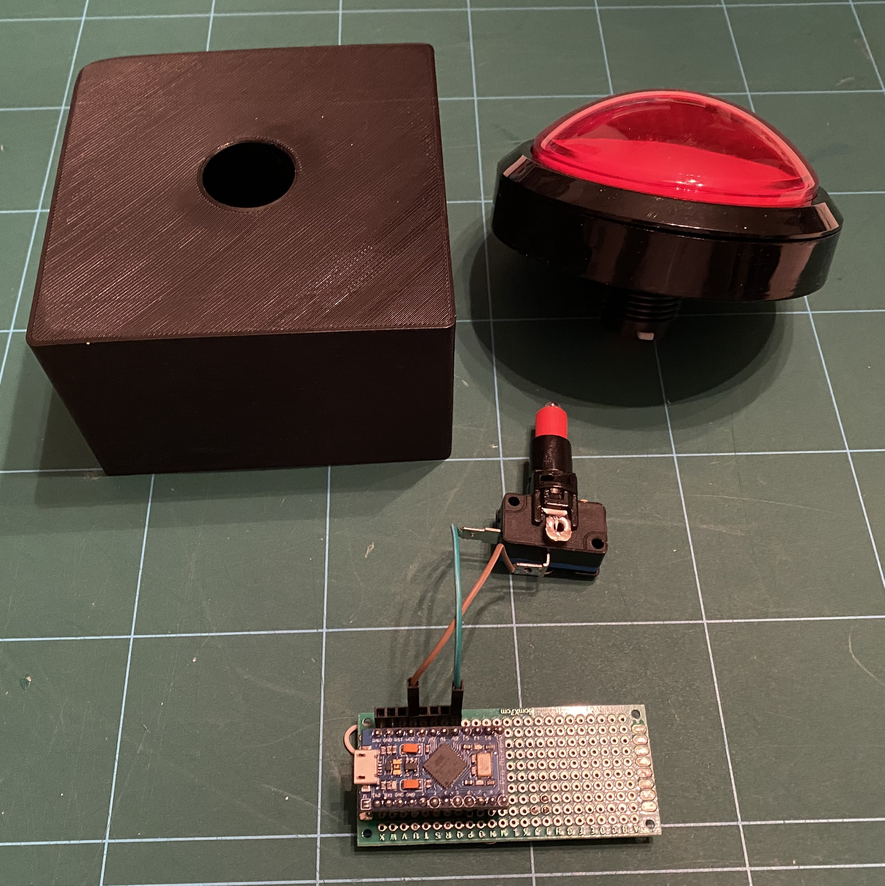

# Teams mute button


L'idée de ce projet est de créer un bouton **Mute** / **Unmute** pour Microsoft Teams.

Pour se faire, on va utiliser un Arduino pro micro.

Celui-ci va executer le raccourci clavier Teams **CTRL** + **SHIFT** + **M**.


## Matériel utilisé
* 1 Arduino pro micro
* 1 bouton poussoir [Exemple](https://fr.aliexpress.com/item/32861018331.html?spm=a2g0s.9042311.0.0.65b76c370mm7hc)
* 1 résistance 4.7K ohms minimum
* 1 plaque PCB (optionel)
* 1 boitier
  * Dans mon cas, un boitier imprimé en 3D. [Boite stl](src/mute_button_box.stl) [Couvercle](src/lid.stl)


## Branchement de l'Arduino



Le principe est simple. Lorsque le bouton est actionné, celà va alimenter la Pin 18 (A0) de l'Arduino.

Afin d'éviter les parasites, il faut réaliser un montage "pull down" à l'aide d'une résitance (d'au moins 4.7K ohms) pour s'assurer que notre Pin 18 (A0) est toujours dans un etat "Down" lorsque l'interrupteur n'est pas actionné.


## Programme

* Charger le fchier [muteButton.ino](src/muteButton.ino) dans [Arduino IDE](https://www.arduino.cc/en/software)
* Selectionnez la carte utilisée : "Tools" => "Board" => "Arduino Micro"
* Modifier la constante **BUTTON_PIN** en fonction de la PIN que vous utilisez
* Compilez et transferez le programme sur votre Arduino

Afin de tracker l'execution de mon programme, j'ai utilisé l'utilitaire [Carnac](https://github.com/bfritscher/carnac/releases/tag/v3-beta) pour afficher les touches pressées.
Ca m'a permis de comprendre que l'Arduino fonctionne en QUERTY :)

_Note: Avec un clavier AZERTY, il faut utiliser le raccourci clavier **CTRL** + **SHIFT** + **;**_

### Option
Il est possible d'ajouter le raccourci clavier **WinKey** + **1-9** pour mettre en premier plan la fenêtre Teams avant de Mute/Unmute

Voici le code à ajouter au début de la méthode **executeShortKeys()**

```c
Keyboard.press(winKey);
Keyboard.press('1'); // Position in task bar
delay(100);
Keyboard.releaseAll();
delay(100);
```

## Montage


